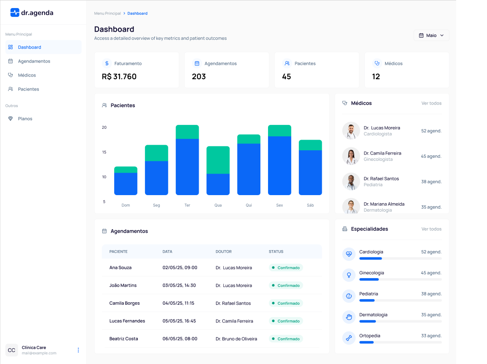
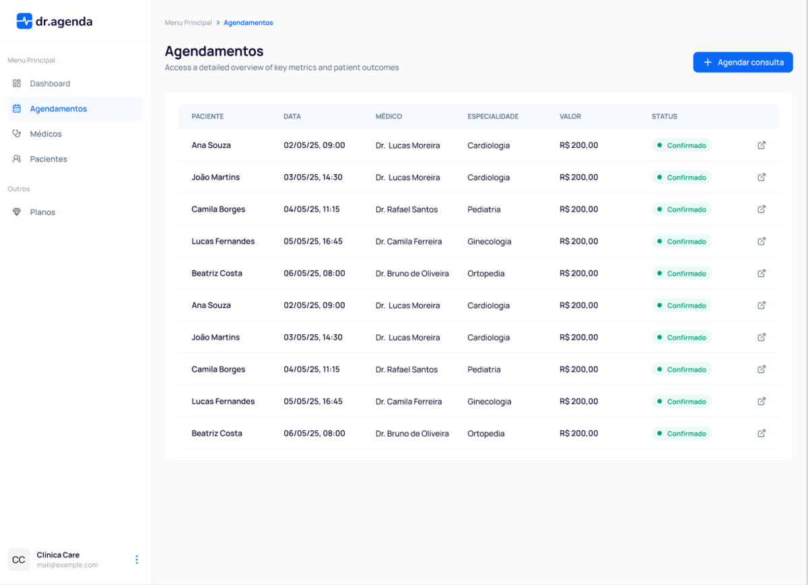
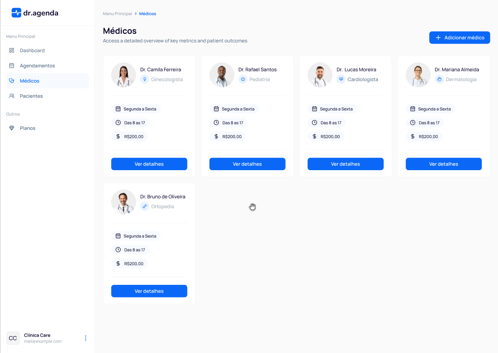
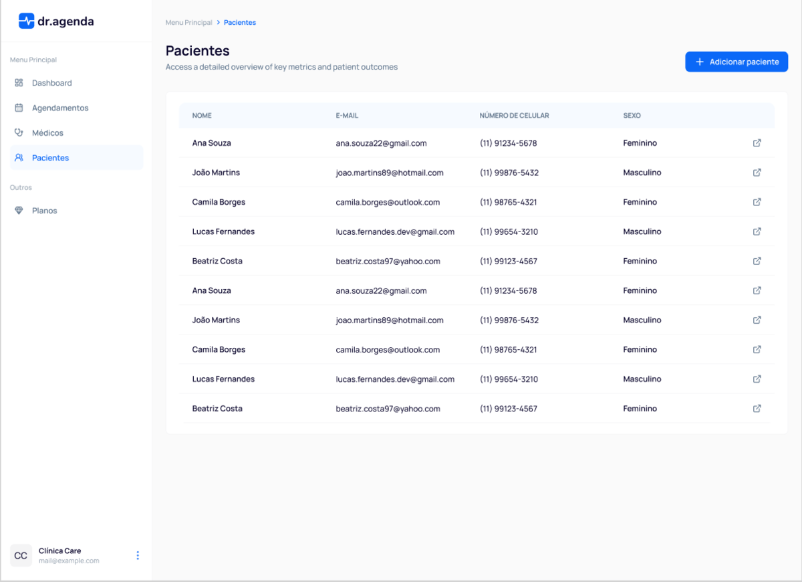
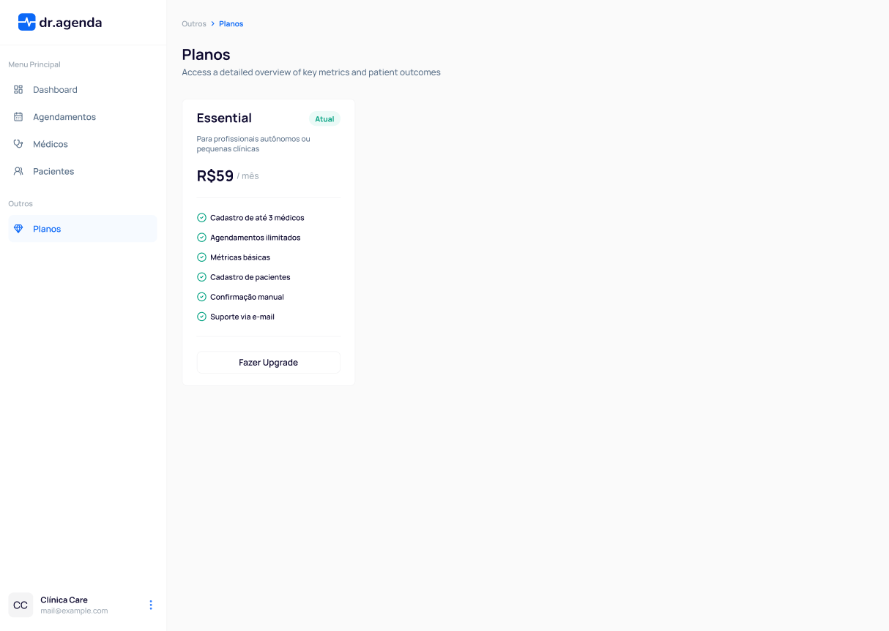
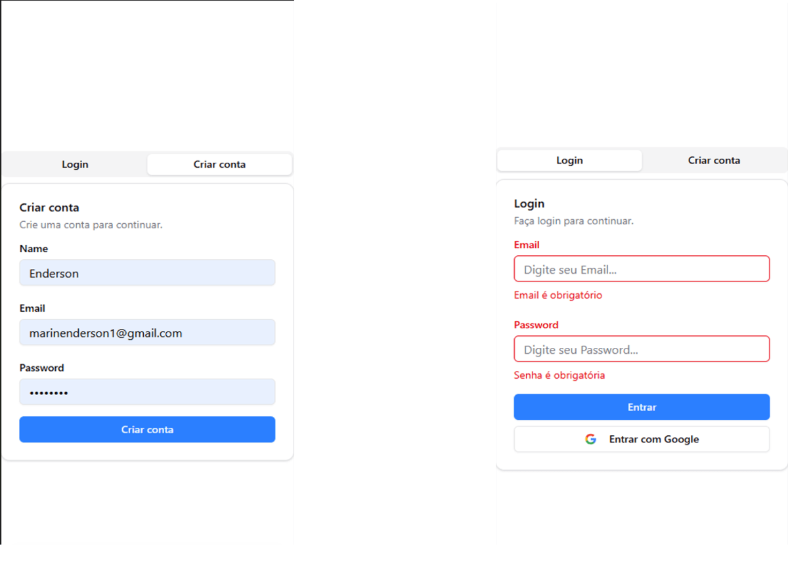

## Título do Projeto

APLICATIVO DE GESTION DE AGENDAMENTOS PARA CLINICAS

## Descrição do Projeto

O Doutor Agenda é uma plataforma web moderna e completa para gestão de clínicas, desenvolvida com um foco em desempenho, segurança e uma experiência de usuário intuitiva. O projeto se destaca por oferecer funcionalidades essenciais para a área da saúde, incluindo um sistema de agendamento online, gestão de pacientes, e um painel de controle administrativo com visualização de dados.

## Funcionalidades-Chave:

Agendamento Eficiente: Um sistema de agendamento robusto que permite a marcação, cancelamento e reagendamento de consultas de forma simples e intuitiva.

Gestão de Pacientes e Perfil de Usuário: Autenticação segura de usuários e gestão de perfis para profissionais da saúde e pacientes.

Pagamentos Integrados: O sistema conta com integração segura com a API do Stripe para processamento de pagamentos, permitindo transações online de forma fluida.

Visualização de Dados: Utiliza a biblioteca Recharts para criar gráficos e visualizações de dados, oferecendo um painel analítico que auxilia na tomada de decisões.

## Stack Tecnológica:

Frontend: A interface do usuário é construída com React e o framework Next.js, garantindo um desempenho rápido com renderização do lado do servidor (SSR). O projeto utiliza TypeScript para maior robustez e tipagem de código.

Design e Componentes: O design é moderno e responsivo, utilizando o framework Tailwind CSS para estilização. Componentes UI acessíveis e reutilizáveis são implementados com o uso de bibliotecas como Radix UI, garantindo uma experiência consistente em diferentes dispositivos.

Gerenciamento de Estado e Dados: O sistema gerencia o estado do servidor de forma eficiente com o TanStack Query, otimizando a busca, cache e atualização de dados. A validação de formulários é realizada de forma segura e robusta com React Hook Form e Zod.

Backend e Banco de Dados: A camada de backend utiliza recursos do Next.js, como Server Actions, e interage com um banco de dados PostgreSQL através do Drizzle ORM, proporcionando uma gestão de dados segura e tipada.

## Capturas de Tela

<div style="overflow-x: auto;">
    <table style="width: 100%;">
        <tr>
            <td style="width: 50%;"></td>
            <td style="width: 50%;"></td>
        </tr>
        <tr>
            <td style="width: 50%;"></td>
            <td style="width: 50%;"></td>
        </tr>
        <tr>
            <td style="width: 50%;"></td>
            <td style="width: 50%;"></td>
        </tr>
    </table>
</div>

## Começando

### Pré-requisitos

Você precisa instalar o seguinte software

1.  NODEJS(VERSION: 20.10.0)
2.  NPM(VERSION: 10.2.3)
3.  GIT

### A maneira mais fácil para começar é clonar o repositório:

git clone [https://github.com/ENDERSON-MARIN/DOUTOR-AGENDA](https://github.com/ENDERSON-MARIN/DOUTOR-AGENDA)

### Mude o diretório e abra no editor de texto

- cd your-project-directory
- open in your text editor

### Configure suas variáveis de ambiente (Clone o arquivo .env.template e renomeie para .env)

- DATABASE_URL="YOUR_CONNECTION_STRING"
- BETTER_AUTH_SECRET=""
- BETTER_AUTH_URL=#Base URL of your app

- GOOGLE_CLIENT_ID=""
- GOOGLE_CLIENT_SECRET=""

- NEXT_PUBLIC_STRIPE_PUBLISHABLE_KEY=""
- STRIPE_SECRET_KEY=""
- STRIPE_ESSENTIAL_PLAN_PRICE_ID=""
- NEXT_PUBLIC_APP_URL=#Base URL of your app
- STRIPE_WEBHOOK_SECRET=""

### Inicie seu aplicativo de forma muito simples

- Run the DB migrations

```
npx drizzle-kit push
```

- Run Drizzle Studio locally

```
npx drizzle-kit studio
```

- Start the project in development mode

```
npm run dev
```

- Você pode verificar que o site estará funcionando em localhost
  http://localhost:3000

- You can check db will be up and running on localhost
  https://local.drizzle.studio/

## Autor

- [Enderson Marín](https://www.marinenderson.com)

## Meu contato:

- 📧 Email: marinenderson1@gmail.com
- 🐱 GitHub: https://github.com/ENDERSON-MARIN
- 🌐 Portfolio: https://portfolio-ecmm.vercel.app/
- 💼 LinkedIn: https://www.linkedin.com/in/enderson-marin

## Vídeos de Demonstração

- Você pode verificar um vídeo de demonstração do meu projeto no seguinte canal:

  https://www.youtube.com/channel/UCDIIj706aFneZlfVJucVkhA

## Licença

Este projeto está licenciado sob a Licença MIT - consulte o arquivo [LICENSE.md](LICENSE.md) para obter detalhes
